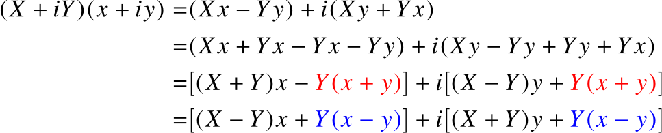

# Complex-mult
Multiplication of complex numbers in 3 multiplications in real

Usually a multiplication of 2 complex numbers requires 4 mul and 2 add/sub in real.
By exploiting the following modification, the number of multiplication can be reduced to 3
in expense of extra additions and subtractions.

